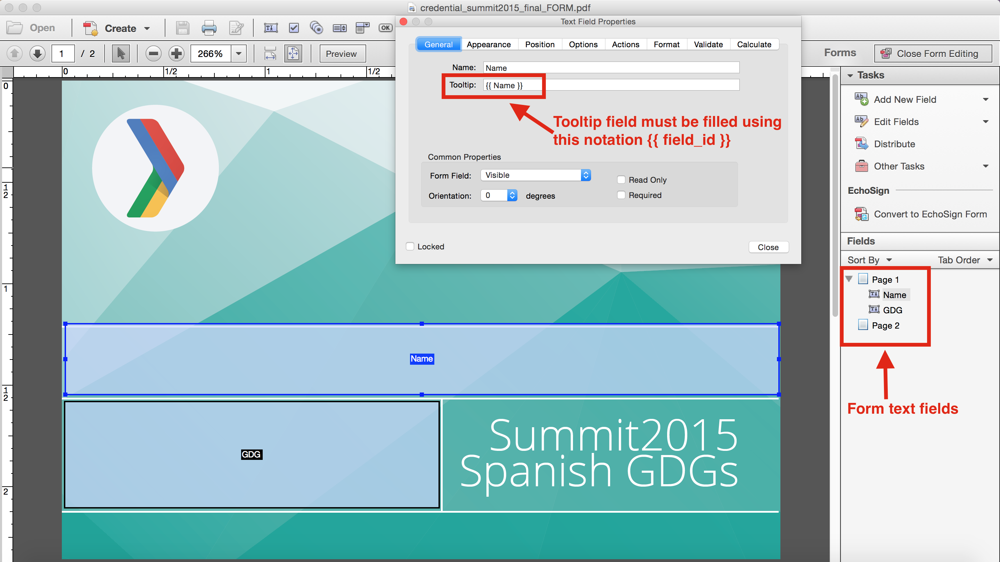
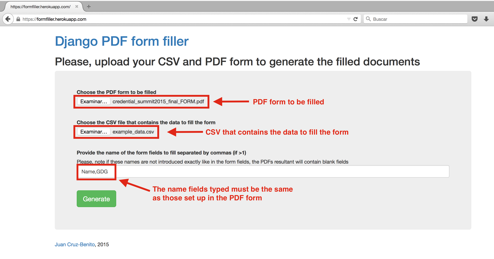

# Django PDF Form filler #

This Git repo contains the code of the Django PDF Form filler app developed by Juan Cruz-Benito. This is a sample app of filling PDFs form using data contained in a CSV file

### Why to use it? ###

This web app enables users to fill PDF forms automatically, by combining PDF Forms with data contained in a CSV file. This application is highly recommended to automate the generation of conference certificates, accreditations or any other batch tasks regarding filling PDF forms.

### Libraries used in the code ###

* [pdfjinja](https://github.com/rammie/pdfjinja)
* [django-bootstrap3](https://github.com/dyve/django-bootstrap3)

### Some functionalities ###

* Generation of PDF Forms filled using CSV data
* One PDF per CSV row (now with no limitation of PDF amount to generate)
* The application returns a .zip file with all the PDFs generated
* The CSV, PDF form, PDFs generated and other files are deleted instantaneously from the server after the zip file download.
* Ready to be deployed on [Heroku](http://heroku.com/)

### Using application ###

To generate the filled PDFs, first create a PDF form. Take care setting up the tooltip option in the form's text fields, use the same notation as used in the following image

Later use the same fields names in the application to fill them with the data enclosed in the CSV file (the number of fields typed must be the same as the CSV columns)

### Deploying application on Heroku ###

* Heroku reference deploying Django application - https://devcenter.heroku.com/articles/getting-started-with-django
* Installing PDFTK to enable PDF filling options (appart from using libraries included in requirements.txt) - http://iamsonivivek-pdftk.blogspot.com.es/
* If you are deploying the app on other hosting solution (or localhost i.e.), set *HEROKU_DEPLOY* variable to *False* in *settings.py* Also you can remove the *vendor* folder and *Procfile* when not deploying on Heroku (required for use PDFtk resources)

Note: If you are planning on generate a high amount of filled PDFs or your initial PDF form file size is big, consider to deploy the app in a Heroku paid-account or another hosting. Due disk restrictions, the app could show you repeatedly an error if the disk limit is reached while generating filled PDFs.

### Demo ###

Check out the live demo in https://formfiller.herokuapp.com/ 

To test it, you can use the PDF form and CSV example file contained in the *resources_examples* folder within this repository.

## About Juan Cruz-Benito ##

Ping me on

* Twitter [@_juancb](https://twitter.com/_juancb)
* Google+ [+JuanCruzBenito](https://plus.google.com/+JuanCruzBenito)
* [Linkedin](https://linkedin.com/in/juancb)
* [Website](http://juancb.es)

## License ##

    Copyright 2015 Juan Cruz-Benito

    Licensed under the Apache License, Version 2.0 (the "License"); 
    you may not use this file except in compliance with the License.
    You may obtain a copy of the License at

       http://www.apache.org/licenses/LICENSE-2.0

    Unless required by applicable law or agreed to in writing, software
    distributed under the License is distributed on an "AS IS" BASIS,
    WITHOUT WARRANTIES OR CONDITIONS OF ANY KIND, either express or implied.
    See the License for the specific language governing permissions and
    limitations under the License.
